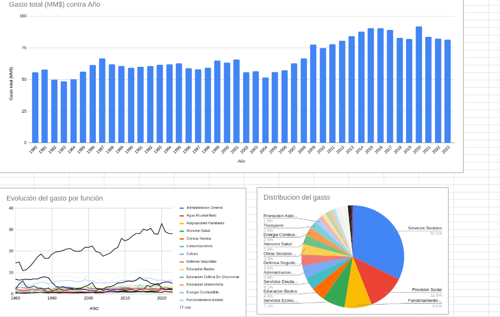

# Análisis del gasto público por función (Argentina)

Proyecto de análisis de datos realizado en Google Sheets / Excel a partir de un dataset público oficial sobre gasto público consolidado.

El objetivo fue limpiar, modelar y analizar los datos para construir visualizaciones claras que permitan entender la evolución del gasto y su distribución por función del Estado.

---

## Objetivo del proyecto

- Analizar la evolución del gasto público a lo largo del tiempo
- Comparar el gasto entre distintas funciones del Estado
- Construir un dashboard claro y legible orientado a análisis exploratorio

---

## Herramientas utilizadas

- **Google Sheets / Microsoft Excel**
- Limpieza y normalización de datos
- Consultas avanzadas con `QUERY`, `GROUP BY` y `PIVOT`
- Visualización de datos (gráficos de líneas, barras y torta)

---

## Estructura del archivo

El archivo está organizado siguiendo una arquitectura típica de análisis de datos:

- **raw_data**
  Datos originales sin modificaciones.

- **clean_data**
  Datos limpiados y normalizados (fechas, nombres de funciones, valores nulos).

- **analysis**
  Tablas de análisis generadas mediante consultas:
  - Gasto total por año
  - Evolución del gasto por función
  - Ranking general por función

- **dashboard**
  Visualizaciones finales:
  - Evolución del gasto público por función
  - Ranking de funciones según gasto acumulado
  - Distribución del gasto por función

---

## Principales resultados

- Identificación de tendencias temporales en el gasto público.
- Comparación entre funciones con mayor y menor participación relativa.
- Visualización clara de la composición del gasto a lo largo del período analizado.

El dashboard permite interactuar con los gráficos (mostrar u ocultar funciones) para facilitar la exploración de los datos.

---

## Fuente de datos

Dataset público oficial sobre gasto público consolidado, descargado de un portal gubernamental de datos abiertos.

---

## Notas

Este proyecto fue realizado con fines de aprendizaje y portfolio, siguiendo buenas prácticas de análisis de datos, separación de capas (datos, análisis y visualización) y presentación clara de resultados.

---

## Dashboard

Autor: Roger Morinigo

